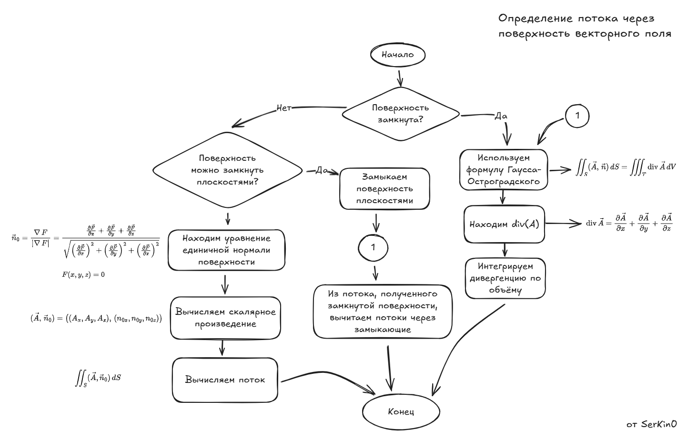

# 📐 Векторный и тензорный анализ

| **Лектор**        | Дубков Александр Александрович |
| :---------------- | :----------------------------- |
| Практикант        | Дубков Александр Александрович |
| **Экзамен/Зачет** | Экзамен                        |
| **Дисциплина**    | Векторный и тензорный анализ   |

## Экзамен

### Сборник задач и решений с экзамена и пересдачи

| №   | Автор           | Название                                                                                                  | Год  | Ссылки                                                  |
| :-- | :-------------- | :-------------------------------------------------------------------------------------------------------- | :--: | :------------------------------------------------------ |
| 1   | А.А. Дубков     | Билеты с экзамена (зима 2026)                                                                             | 2026 | [`[Диск]`](https://cloud.mail.ru/public/EgG3/R3YyRM2dh) |
| 2   | А.А. Дубков     | Билеты с первой пересдачи (зима 2026)                                                                     | 2026 | [`[Диск]`](https://cloud.mail.ru/public/tmrf/jZyXvLxAe) |
| 3   | С.А. Скороходов | Решение задач                                                                                             | 2026 | [`[Диск]`](https://cloud.mail.ru/public/zLoP/avbmoZ9hy) |
| 4   | А.А. Дубков     | Программа-минимум по курсу “Векторный и тензорный анализ” (3 семестр 2025/26 учебного года)               | 2026 | [`[Диск]`](https://cloud.mail.ru/public/JLWW/XvBHRUTAE) |
| 5   | А.А. Дубков     | Список экзаменационных вопросов по курсу “Векторный и тензорный анализ” (3 семестр 2025/26 учебного года) | 2025 | [`[Диск]`](https://cloud.mail.ru/public/Bfjm/GWP6vYZzW) |
| 6   | С.А. Скороходов | План минимум для пересдачи (на разных листах и на одном)                                                  | 2026 | [`[Диск]`](https://cloud.mail.ru/public/Shw9/EEXdWBqG8) |

### Алгоритм решения задачи на определение потока

